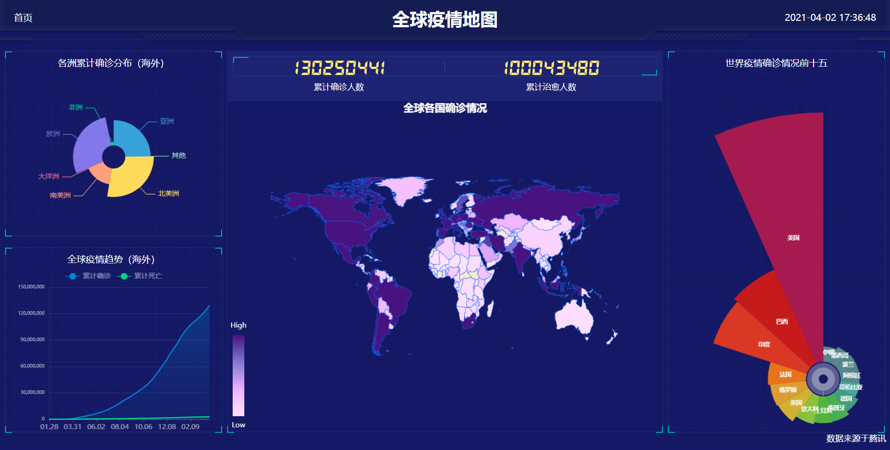

# 简介

调用腾讯疫情数据接口，使用ECharts以及ECharts自带的地图js文件构建可视化界面

本项目已经部署在 [Github Pages](https://dong-666.github.io/te/) 以及 [Gitee Pages](https://ypigy.gitee.io/te/)上了，可以直接点击访问，建议国内访问 [Gitee Pages](https://ypigy.gitee.io/te/)

# 目录结构

- css（页面样式）
- font（字体文件）
- images（图片文件夹）
- js
  - china.js（中国地图文件）
  - echarts.min.js （echarts文件）
  - flexible.js（rem自适应布局文件）
  - **index.js（echarts图表配置文件）**
  - jquery.js（JQ文件）
  - world.js（世界地图文件）

# 下载解压完直接使用

